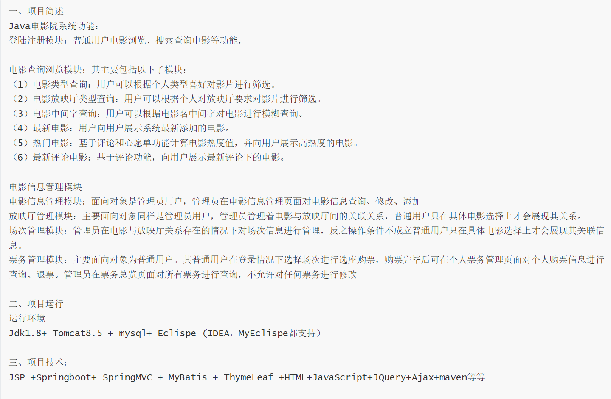
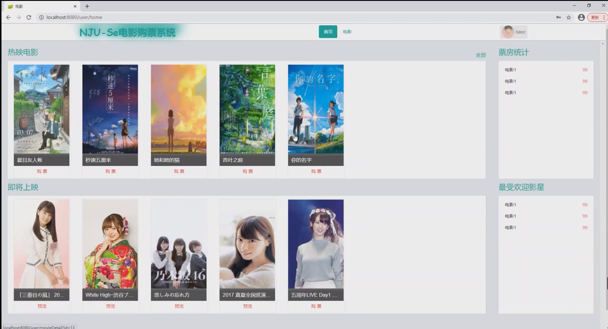
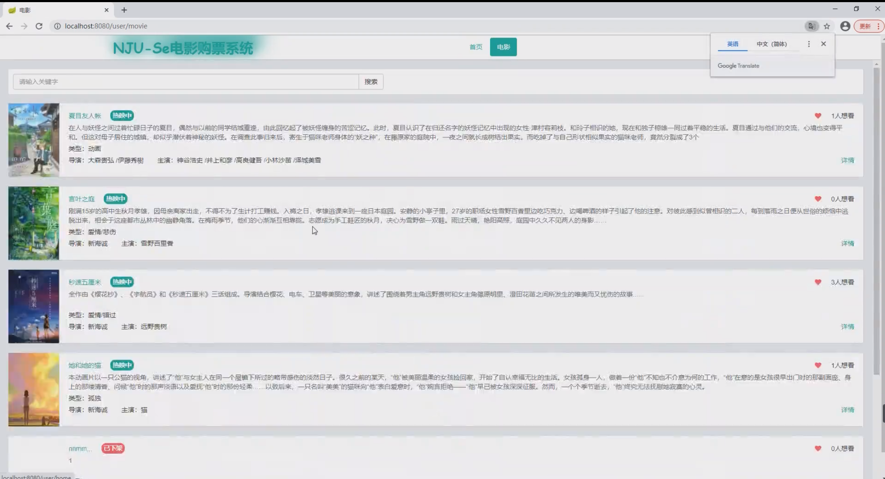
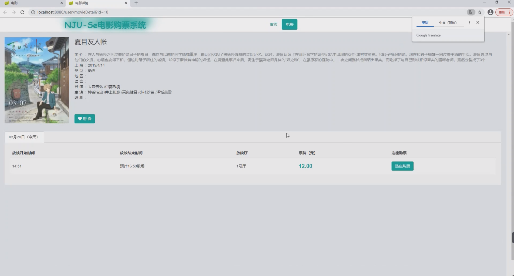
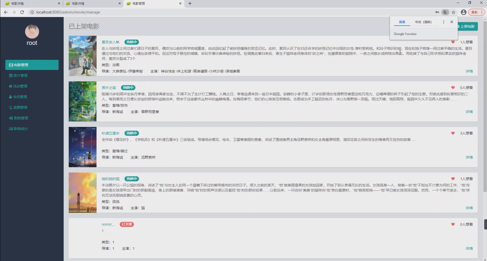
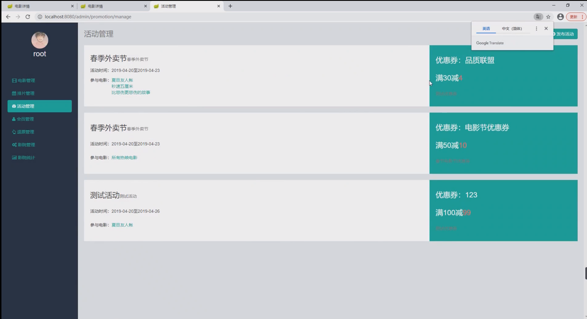

基于Springboot的Java电影院系统
=
### 完整代码获取地址：从戎源码网 ([https://armycodes.com/](https://armycodes.com/))
### 作者微信：19941326836  QQ：952045282 
### 承接计算机毕业设计、Java毕业设计、Python毕业设计、深度学习、机器学习
### 选题+开题报告+任务书+程序定制+安装调试+论文+答辩ppt 一条龙服务
### 所有选题地址https://github.com/nature924/allProject

一、项目介绍
---
系统包含两种角色：用户、管理员，系统分为前台和后台两大模块，主要功能如下：

### 登陆注册模块：普通用户电影浏览、搜索查询电影等功能，

### 电影查询浏览模块：其主要包括以下子模块：
（1）电影类型查询：用户可以根据个人类型喜好对影片进行筛选。
（2）电影放映厅类型查询：用户可以根据个人对放映厅要求对影片进行筛选。
（3）电影中间字查询：用户可以根据电影名中间字对电影进行模糊查询。
（4）最新电影：用户向用户展示系统最新添加的电影。
（5）热门电影：基于评论和心愿单功能计算电影热度值，并向用户展示高热度的电影。
（6）最新评论电影：基于评论功能，向用户展示最新评论下的电影。

### 电影信息管理模块
电影信息管理模块：面向对象是管理员用户，管理员在电影信息管理页面对电影信息查询、修改、添加
放映厅管理模块：主要面向对象同样是管理员用户，管理员管理着电影与放映厅间的关联关系，普通用户只在具体电影选择上才会展现其关系。
场次管理模块：管理员在电影与放映厅关系存在的情况下对场次信息进行管理，反之操作条件不成立普通用户只在具体电影选择上才会展现其关联信息。
票务管理模块：主要面向对象为普通用户。其普通用户在登录情况下选择场次进行选座购票，购票完毕后可在个人票务管理页面对个人购票信息进行查询、退票。管理员在票务总览页面对所有票务进行查询，不允许对任何票务进行修改

二、项目技术
---
- 编程语言：Java
- 数据库：MySQL
- 项目管理工具：Maven
- 前端技术：VUE、HTML、Jquery、Bootstrap
- 后端技术：Spring、SpringMVC、MyBatis

三、运行环境
---
- 操作系统：Windows、macOS都可以
- JDK版本：JDK1.8以上都可以
- 开发工具：IDEA、Ecplise、Myecplise都可以
- 数据库: MySQL5.7以上都可以
- Tomcat：任意版本都可以
- Maven：任意版本都可以

四、运行截图
---

### 程序截图：

